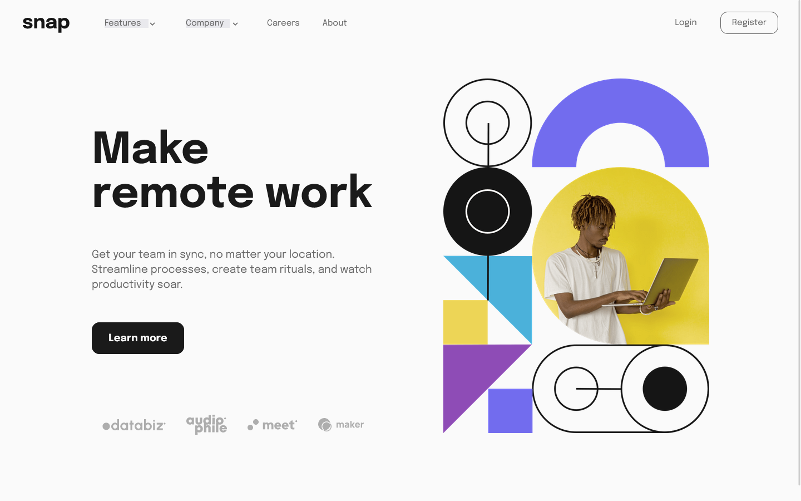

# Frontend Mentor - Intro section with dropdown navigation solution

This is a solution to the [Intro section with dropdown navigation challenge on Frontend Mentor](https://www.frontendmentor.io/challenges/intro-section-with-dropdown-navigation-ryaPetHE5). Frontend Mentor challenges help you improve your coding skills by building realistic projects. 

## Table of contents

- [Overview](#overview)
  - [The challenge](#the-challenge)
  - [Screenshot](#screenshot)
  - [Links](#links)
- [My process](#my-process)
  - [Built with](#built-with)
  - [What I learned](#what-i-learned)
  - [Useful resources](#useful-resources)

## Overview

### The challenge

Users should be able to:

- View the relevant dropdown menus on desktop and mobile when interacting with the navigation links
- View the optimal layout for the content depending on their device's screen size
- See hover states for all interactive elements on the page

### Screenshot

### Links

- Solution URL: [Add solution URL here](https://your-solution-url.com)
- Live Site URL: [Add live site URL here](https://your-live-site-url.com)

## My process

### Built with

- Semantic HTML5 markup
- CSS custom properties
- CSS Flexbox
- Mobile-first workflow
- Vanilla JavaScript

### What I learned

In this project, I learned more about CSS Flexbox, which the time I was first introduced to this topic I was really confused about. I also learned to use utility classes, which I'm going to do from now on everytime I start a new project as it makes my styling somewhat fast and easy. I'm also gonna add some of the JavaScript DOM methods I learned from this project.

I'm look forward for more frontend development projects in the future, along with new learnings!

### Useful resources

- [Resource 1](https://www.w3schools.com/) - This website helped me by providing the syntax I didn't know, mostly about JavaScript DOM.
- [Resource 2](https://developer.mozilla.org/en-US/) - This is also an amazing learning resource I used for all of my projects.